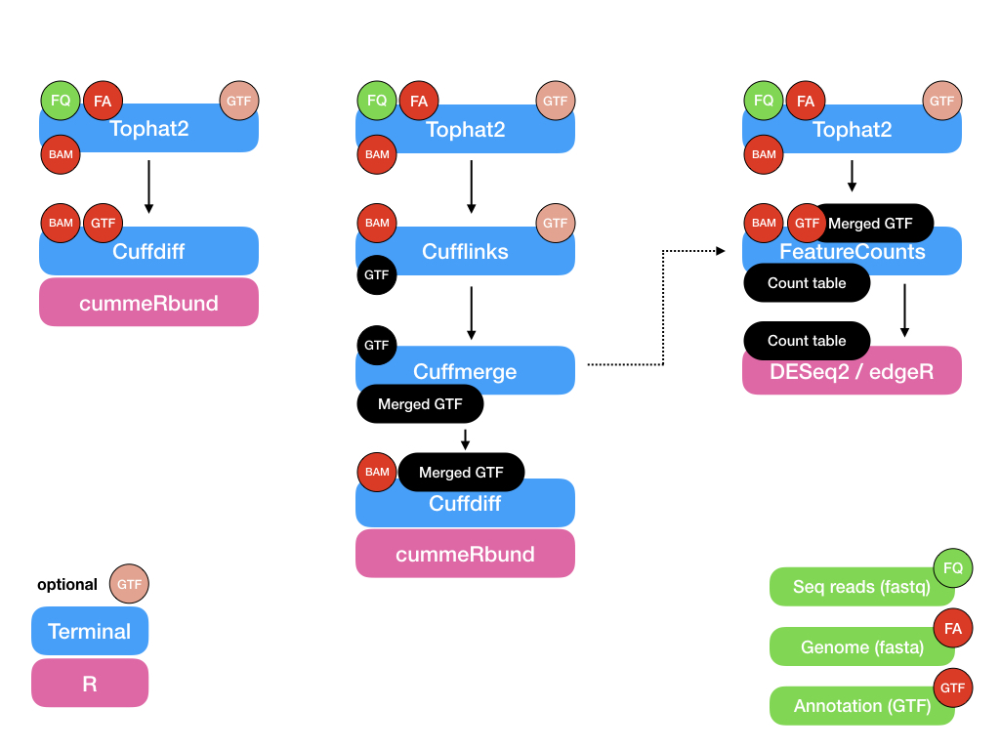

# Bioinformatics training: transcriptomics

# Protocol
We will follow the protocol described in [Tophat2 bioinformatic protocol](https://www.ncbi.nlm.nih.gov/pmc/articles/PMC3334321/) published in [Nature protocol, 2012](https://www.nature.com/articles/nprot.2012.016) for this course. 



# Day 1
* Introduction of transcriptomic analyses 
* Discusssion regarding reference-based and de novo approaches
* How to use tophat v2 - based on the Nature protocol (2012) paper
* Download genome reference and create an index using bowtie2

* in /work/projects/nn9305k/home/<username>/transcriptome/ref
```
$ ln ../../../../bioinf_course/transcriptomics/ref/Dm.BDGP6.dna.toplevel.fa .
$ ls ../../../../bioinf_course/transcriptomics/ref/Dm.BDGP6.91.gtf .
$ bowtie2-build Dm.BDGP6.dna.toplevel.fa Dm_BDGP6_genome
```
  
* USAGE
```
$ bowtie2-build <Reference_fasta_file_name> <bowtie2-build_ref_index_name_that_you_will_use_later>
```

## To do
* Align the given reads to the Drosophila genome using tophat v2
* create a new folder called tophat in /work/projects/nn9305k/home/<username>/transcriptome/
* create a slurm script with *time=12:00:00*, *ntasks=16* and *mem-per-cpu=12Gb*
```
$ tophat -p 16 -G ../ref/Dm.BDGP6.91.gtf -o <tophat_output_folder_name> ../ref/Dm_BDGP6_genome <read1> <read2>
```

# Day 2
* Discuss results from tophat v2 alignemnt
* Read about cufflinks and differential expression analysis pipeline

## To do
* Run cufflinks on the tophat output
* Within *tophat* folder create a slurm script with *time=12:00:00*, *ntasks=16* and *mem-per-cpu=12Gb*
```
$ cufflinks -p 16 -o <cufflinks_output_folder_name> <tophat_output_folder_name>/accepted_hits.bam
```

# Day 3
* Discuss about (long) using tophat -> cufflinks -> cuffmerge -> cuffdiff pipeline (To find novel transcripts and genes)
* Discuss about (short) using tophat -> cuffdiff pipeline (To calculate differential expression for only known genes and transcripts)

## To do
* Run cuffmerge and cuffdiff on Day 2's cufflinks output
* create a text file and call it *assemblies.txt* and it should contain the information below
```
$ cat assemblies.txt
<cufflinks_output_folder_name_for_Con1_Rep1>/transcripts.gtf
<cufflinks_output_folder_name_for_Con1_Rep2>/transcripts.gtf
<cufflinks_output_folder_name_for_Con1_Rep3>/transcripts.gtf
<cufflinks_output_folder_name_for_Con2_Rep1>/transcripts.gtf
<cufflinks_output_folder_name_for_Con2_Rep2>/transcripts.gtf
<cufflinks_output_folder_name_for_Con2_Rep3>/transcripts.gtf
```

* Within *tophat* folder create a slurm script with *time=12:00:00*, *ntasks=8* and *mem-per-cpu=12Gb*
```
$ cuffmerge -o <cuffmerge_output_folder_name> -g ../ref/Dm.BDGP6.91.gtf -s ../ref/Dm.BDGP6.dna.toplevel.fa -p 8 assemblies.txt
```

* For the long pipeline, create a slurm script
```
cuffdiff -o cuffdiff_long_output -p 16 -L Con1_l,Con2_l <cuffmerge_output_folder_name>/merged.gtf Con1_Rep1_tophat/accepted_hits.bam,Con1_Rep2_tophat/accepted_hits.bam,Con1_Rep3_tophat/accepted_hits.bam Con2_Rep1_tophat/accepted_hits.bam,Con2_Rep2_tophat/accepted_hits.bam,Con2_Rep3_tophat/accepted_hits.bam
```
* For the short pipeline, create a slurm script
```
cuffdiff -o cuffdiff_short_output -p 16 -L Con1_s,Con2_s ../ref/Dm.BDGP6.91.gtf Con1_Rep1_tophat/accepted_hits.bam,Con1_Rep2_tophat/accepted_hits.bam,Con1_Rep3_tophat/accepted_hits.bam Con2_Rep1_tophat/accepted_hits.bam,Con2_Rep2_tophat/accepted_hits.bam,Con2_Rep3_tophat/accepted_hits.bam
```

* _Check the above two scripts and identify the difference_

# Day 4
* Load cuffdiff output from short and long pipeline in R using cummeRbund

## To do
* Link to cummeRbund manual: http://compbio.mit.edu/cummeRbund/manual_2_0.html

# Day 5
* Introduction to counting reads

## To do
* Link to featureCounts manual: http://bioinf.wehi.edu.au/featureCounts/

# Day 6
* DESeq2 and cummeRbund

## To do
* Link to DESeq2 webpage: https://bioconductor.org/packages/release/bioc/html/DESeq2.html
* Link to DESeq2 manual: https://bioconductor.org/packages/release/bioc/vignettes/DESeq2/inst/doc/DESeq2.html
* Link to cummeRbund webpage: http://compbio.mit.edu/cummeRbund/
* Link to cummeRbund manual: http://compbio.mit.edu/cummeRbund/manual_2_0.html

* Link to DESeq2 Rscript: [DESeq2.R](transcriptomics_scripts/DESeq2.R)
* Link to cummeRbund Rscript: [cummeRbund.R](transcriptomics_scripts/cummeRbund.R)
